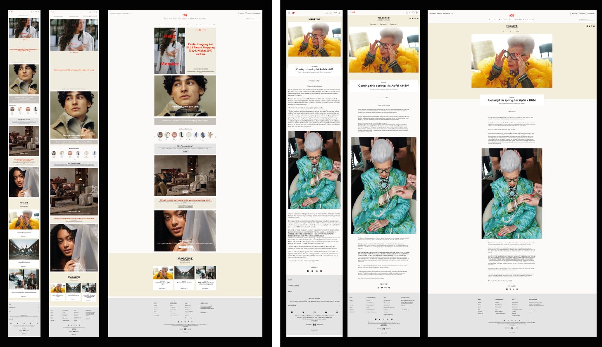
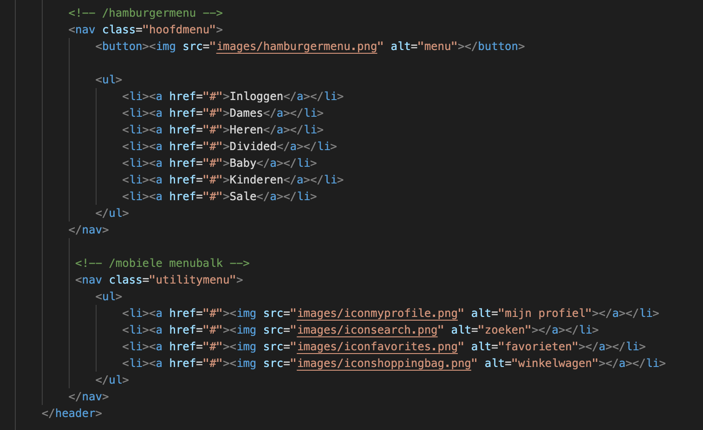
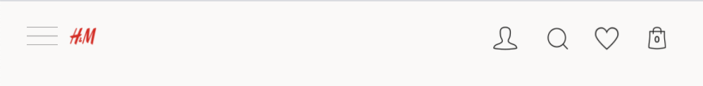
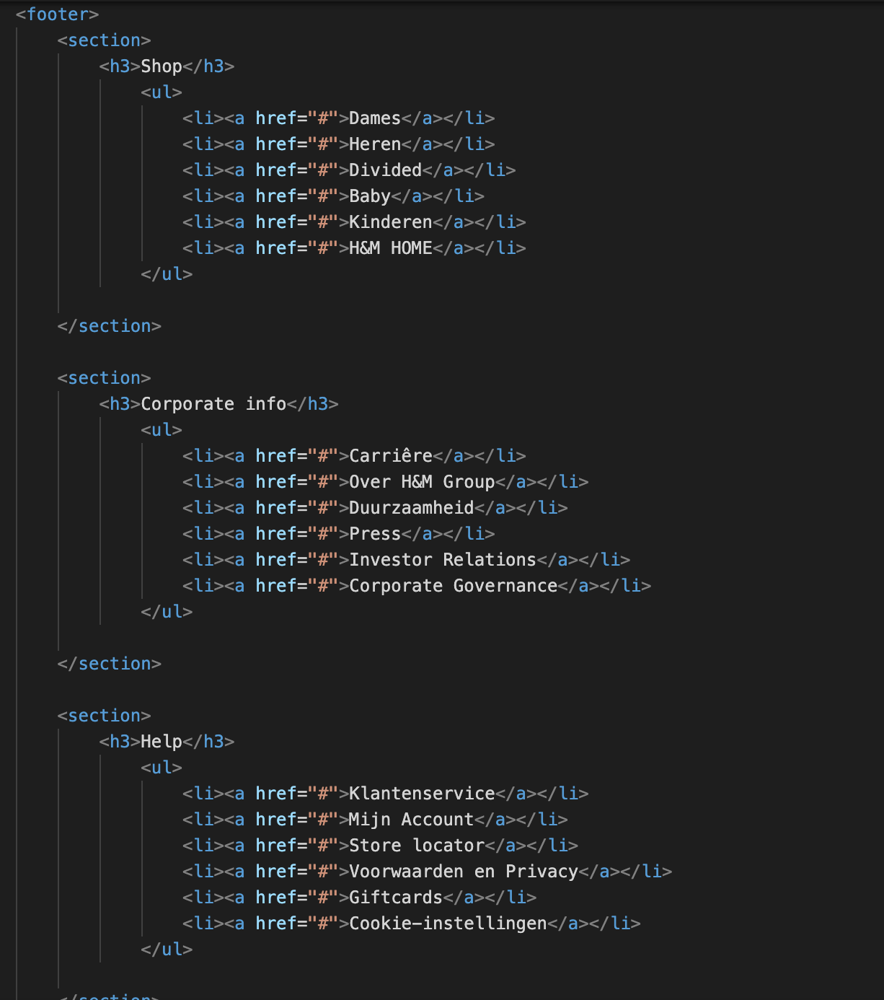
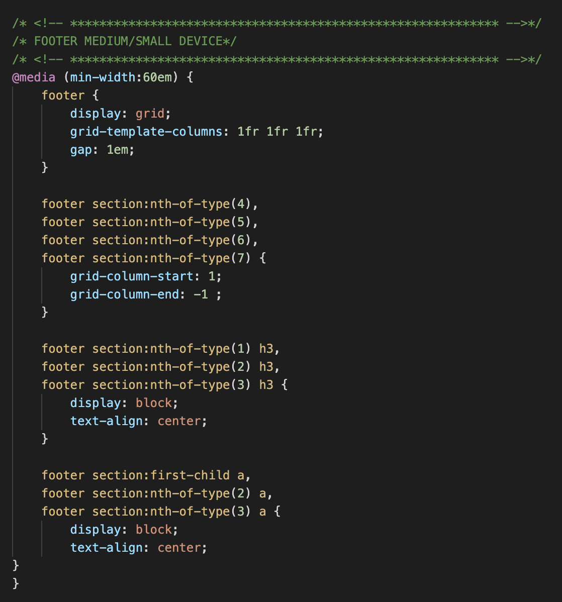
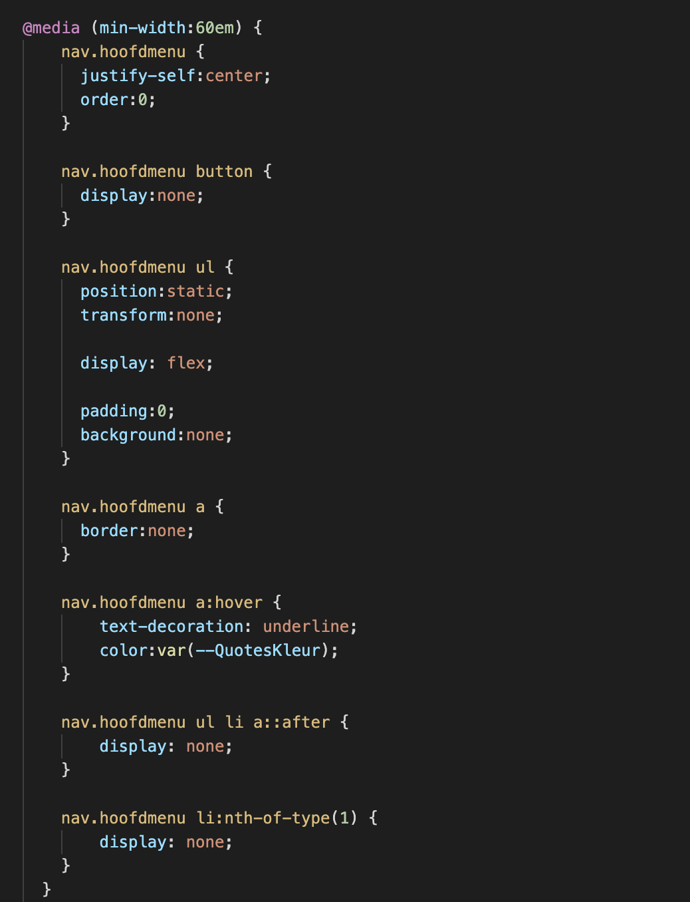
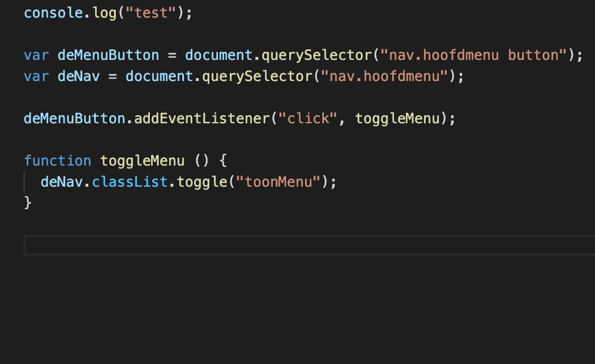
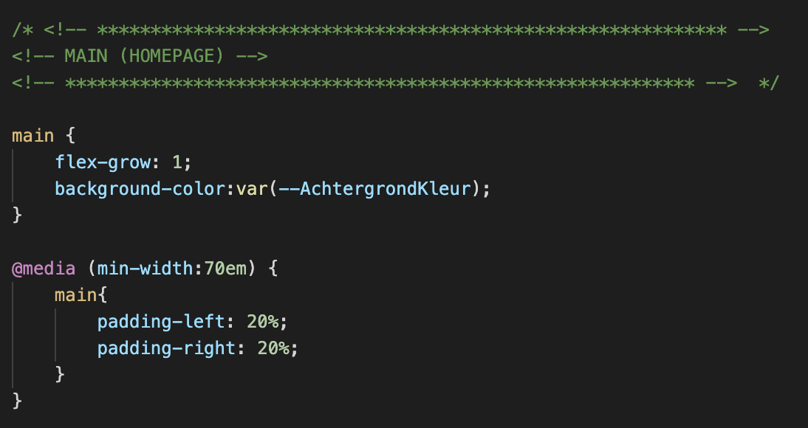

# Procesverslag
Markdown is een simpele manier om HTML te schrijven.  
Markdown cheat cheet: [Hulp bij het schrijven van Markdown](https://github.com/adam-p/markdown-here/wiki/Markdown-Cheatsheet).

Nb. De standaardstructuur en de spartaanse opmaak van de README.md zijn helemaal prima. Het gaat om de inhoud van je procesverslag. Besteedt de tijd voor pracht en praal aan je website.

Nb. Door *open* toe te voegen aan een *details* element kun je deze standaard open zetten. Fijn om dat steeds voor de relevante stuk(ken) te doen.

## Jij

### Auteur:
Sabrina da Silva Gomes

#### Je startniveau:
Rood

#### Je focus:
Responsive
 

## Je website

### Je opdracht:
Ik ga de website van H&M responsive maken. Website: https://www2.hm.com/nl_nl/index.html

#### Screenshot(s) van de pagina's (small screen): 
Homepage & Blogpage
 
 
 

## Breakdownschets (week 1)

### Homepage, productpagina en hamburgermenu: 

## Voortgang 1 (week 2)

### Stand van zaken
 
Het schrijven van de HTML code ging best goed. Dit had ik vrij snel gedaan. Wat ik niet zo slim had gedaan, was dat ik alle elementen meteen in html had geschreven. Toen ik vervolgens met CSS aan de slag ging, stond alles door elkaar heen. Hierdoor was het niet heel overzichtelijk meer. Ik had dit dus beter in delen kunnen doen. 

Het schrijven van de CSS code ging in het begin ook niet heel soepel. Zo ben ik erg lang bezig geweest, om de menubalk netjes te krijgen. Toch is dit uiteindelijk wel gelukt en staat alles netjes naast elkaar. Ik ben nu bijna klaar met de mobiele versie. Als ik het scherm groter maak, staat alles niet goed. Hier moet ik dus nog wel naar kijken. 

### Agenda voor meeting

| Mijn vragen                                                                  |           
| ---                                                                        |                      
| Het aanspreken van de elementen gaat niet helemaal goed                    |                
| Moet alles met position: absolute gepositioneerd worden                    | 
| Hoe krijg je de backgound-color als gehele breedte                         |      
| De images lijken niet in het midden te komen staan                         | 
| Hoe kan ik de footer veranderen bij groter scherm (andere elementen)       |    
| Hoe te starten bij maken van hamburger menu                                |  
| Mag een figure+figcaption in een section komen te staan                    |                      

### Verslag van meeting

Ik heb vele vragen kunnen stellen en hulp gekregen bij knelpunten. Omdat ik de enige was, kon ik daarom ook al heel veel tijdens de meeting aanpassen. Hierdoor zag dus direct verbetering in mijn code. Ook heb ik weer een hoop nieuwe dingen geleerd. Hier heb ik ook aantekeningen van gemaakt. (onderdelen die voor deze website misschien niet helemaal van toepassing zijn, maar wel leuk om te weten) Alle vragen zijn beantwoord en ik weet nu hoe ik weer verder kan!
 
Zo ziet mijn menubalk er nu uit. Dit was eerst niet helemaal goed, omdat ik alles in 1 onderdeel had geschreven en het ook op de verkeerde volgorde was gecodeerd. Nu staat dit gescheiden van elkaar en op de juiste volgorde.
 
   

Verder was ik ook bezig met de footer. Ik kreeg het niet helemaal voor elkaar om deze te laten veranderen bij een ander device. (responsive). Dit moest ik doen door @media te gebruiken. Dit ging mij niet helemaal goed af in het begin. Toch is dit wel gelukt. Zo ziet mijn code er nu uit:
 
     

 

## Voortgang 2 (week 3)

### Stand van zaken
 Deze week ging iets moeilijker dan de week hiervoor. Ik wist hoe ik verder moest en heb dat allemaal kunnen coderen. Hierna kwam het moeilijke deel: namelijk verder coderen, tot alles goed is. Hier liep ik toch een aantal keer vast en was ik best lang bezig om dit te kunnen verbeteren. Uiteindelijk heb ik weer een aantal dingen kunnen toevoegen en gaat de eerste pagina, er steeds beter uit zien.

### Agenda voor meeting

| Mijn vragen      | 
| ---            |
| Hoe kan ik het beste starten, met het maken van een werkend hamburgermenu.                             | 
| Hoe kan mijn menubalk veranderen van menu icoontjes, naar half tekst/half icoon naar volledige teksten?| 
| Op mobiel scherm, wordt het gehele scherm ingenomen. Laptop veel meer witruimte. Hoe begin ik?         | 
| Hoe kan ik het beste afbeeldingen in het midden plaatsen? Lijkt niet te werken bij mij.                | 

### Verslag van meeting
Ook deze week heb ik weer een hoop hulp gekregen. Ook deze keer was ik weer de enige. Hierdoor kon ik weer een hoop vragen. Allereerst was ik begonnen met het maken van een (werkend) hamburgermenu. Zo had ik wel al de items genoteerd, maar was het nog niet echt werkend. Ik had wel het een en ander gevonden op internet. Helaas werkte dit alleen niet. Uiteindelijk hebben we dit samen tijdens de les gedaan. Zo ziet mijn code er nu uit:
 
  

 Verder ben ik ook bezig geweest met het responsive maken van de website. Zo ben ik dus weer aan de slag met @media. De code die ik hiervoor heb geschreven ziet er nu zo uit: (dit was in het begin voor de helft goed. Door de gekregen hulp, is het nu logischer en netter geschreven)
 
 

## Toegankelijkheidstest (week 4)

uitwerken na test in 8e voortgang

### Bevindingen
Lijst met je bevindingen die in de test naar voren kwamen:

#### Titel eerste bevinding
Hier korte omschrijving (met indien nodig een afbeelding)

Hier een omschrijving van hoe het opgelost kan worden (met indien nodig een afbeelding)

#### Titel tweede bevinding. 
Hier korte omschrijving (met indien nodig een afbeelding)

Hier een omschrijving van hoe het opgelost kan worden (met indien nodig een afbeelding)

#### Titel volgende bevinding. 
Hier korte omschrijving (met indien nodig een afbeelding)

Hier een omschrijving van hoe het opgelost kan worden (met indien nodig een afbeelding)

#### Titel nog een bevinding. 
Hier korte omschrijving (met indien nodig een afbeelding)

Hier een omschrijving van hoe het opgelost kan worden (met indien nodig een afbeelding)

## Voortgang 3 (week 4)

uitwerken voor 3e voortgang

### Stand van zaken
hier dit ging goed & dit was lastig (neem ook screenshots op van delen van je website en code)

### Agenda voor meeting
samen met je groepje opstellen

| student 1      | 
| ---            | 
| Footer inklapmenu. Zelfde als hamburgermenu?                           | 
| Hoe kan ik de teksten het beste mooi op zijn plek houden (responsive)  | 
| Hoe kan ik de foto + tekst bij groot device beste coderen (responsive) | 
| Hoe kan ik article elementen bij groot scherm naast elkaar plaatsen    | 
| Hoe kan ik deze titels plaatsen, zonder dat alles verdwijnt.           | 
| Als ik tab inklik, selecteert hij ook de menu items zonder dat deze open is..        | 

### Verslag van meeting
hier na afloop snel de uitkomsten van de meeting vastleggen

- punt 1
- punt 2
- nog een punt
- ...

## Eindgesprek (week 5)

uitwerken voor eindgesprek

### Stand van zaken
hier dit ging goed & dit was lastig (neem ook screenshots op van delen van je website en code)

### Screenshot(s)

hier screenshot(s) van je eindresultaat

## Bronnenlijst

continu bijhouden terwijl je werkt

Nb. Wees specifiek ('css-tricks' als bron is bijv. niet specifiek genoeg).

1. bron 1
2. bron 2
3. ...

