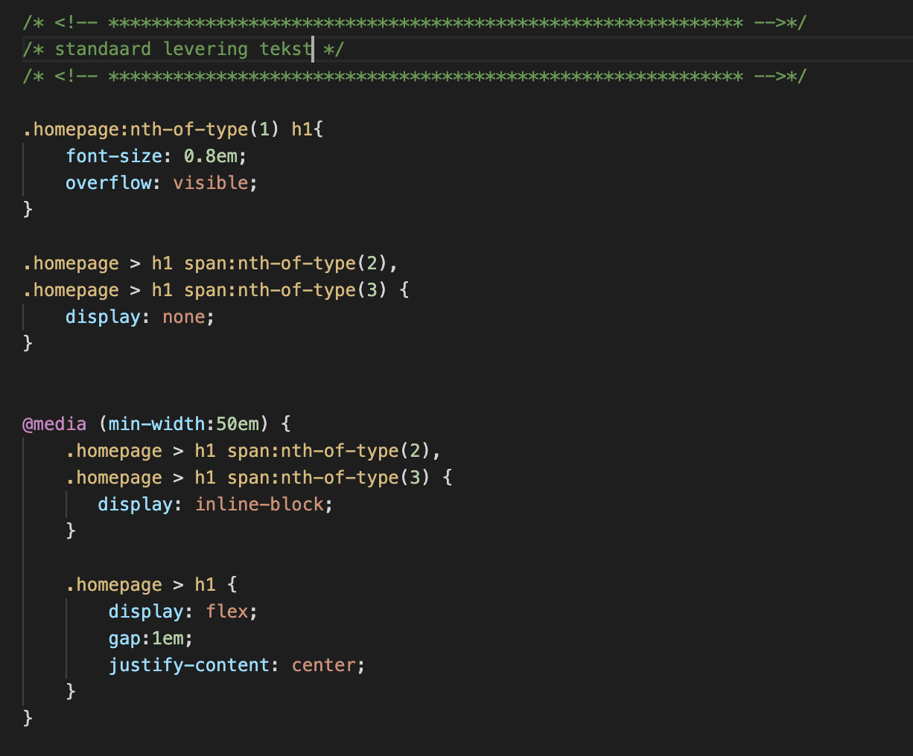

# Procesverslag

## Jij

### Auteur:
Sabrina da Silva Gomes

#### Startniveau:
Rood

#### Focus:
Responsive website
 

## De website

### De opdracht:
Ik ga de website van H&M responsive maken. Website: https://www2.hm.com/nl_nl/index.html

#### Screenshot(s) van de pagina's: 
Homepage & Blogpage
 
 
 

## Breakdownschets (week 1)

### Homepage, productpagina en hamburgermenu: 

## Voortgang 1 (week 2)

### Stand van zaken
 
Het schrijven van de HTML code ging best goed. Dit had ik vrij snel gedaan. Wat ik niet zo slim had gedaan, was dat ik alle elementen meteen in html had geschreven. Toen ik vervolgens met CSS aan de slag ging, stond alles door elkaar heen. Hierdoor was het niet heel overzichtelijk meer. Ik had dit dus beter in delen kunnen doen. 

Het schrijven van de CSS code ging in het begin ook niet heel soepel. Zo ben ik erg lang bezig geweest, om de menubalk netjes te krijgen. Toch is dit uiteindelijk wel gelukt en staat alles netjes naast elkaar. Ik ben nu bijna klaar met de mobiele versie. Als ik het scherm groter maak, staat alles niet goed. Hier moet ik dus nog wel naar kijken. 

### Agenda voor meeting

| Mijn vragen                                                                  |           
| ---                                                                        |                      
| Het aanspreken van de elementen gaat niet helemaal goed                    |                
| Moet alles met position: absolute gepositioneerd worden                    | 
| Hoe krijg je de backgound-color als gehele breedte                         |      
| De images lijken niet in het midden te komen staan                         | 
| Hoe kan ik de footer veranderen bij groter scherm (andere elementen)       |    
| Hoe te starten bij maken van hamburger menu                                |  
| Mag een figure+figcaption in een section komen te staan                    |                      

### Verslag van meeting

Ik heb vele vragen kunnen stellen en hulp gekregen bij knelpunten. Omdat ik de enige was, kon ik daarom ook al heel veel tijdens de meeting aanpassen. Hierdoor zag dus direct verbetering in mijn code. Ook heb ik weer een hoop nieuwe dingen geleerd. Hier heb ik ook aantekeningen van gemaakt. (onderdelen die voor deze website misschien niet helemaal van toepassing zijn, maar wel leuk om te weten) Alle vragen zijn beantwoord en ik weet nu hoe ik weer verder kan!
 
Zo ziet mijn menubalk er nu uit. Dit was eerst niet helemaal goed, omdat ik alles in 1 onderdeel had geschreven en het ook op de verkeerde volgorde was gecodeerd. Nu staat dit gescheiden van elkaar en op de juiste volgorde.
 
   

Verder was ik ook bezig met de footer. Ik kreeg het niet helemaal voor elkaar om deze te laten veranderen bij een ander device. (responsive). Dit moest ik doen door @media te gebruiken. Dit ging mij niet helemaal goed af in het begin. Toch is dit wel gelukt. Zo ziet mijn code er nu uit:
 
     

## Voortgang 2 (week 3)

### Stand van zaken
 Deze week ging iets moeilijker dan de week hiervoor. Ik wist hoe ik verder moest en heb dat allemaal kunnen coderen. Hierna kwam het moeilijke deel: namelijk verder coderen, tot alles goed is. Hier liep ik toch een aantal keer vast en was ik best lang bezig om dit te kunnen verbeteren. Uiteindelijk heb ik weer een aantal dingen kunnen toevoegen en gaat de eerste pagina, er steeds beter uit zien.

### Agenda voor meeting

| Mijn vragen      | 
| ---            |
| Hoe kan ik het beste starten, met het maken van een werkend hamburgermenu.                             | 
| Hoe kan mijn menubalk veranderen van menu icoontjes, naar half tekst/half icoon naar volledige teksten?| 
| Op mobiel scherm, wordt het gehele scherm ingenomen. Laptop veel meer witruimte. Hoe begin ik?         | 
| Hoe kan ik het beste afbeeldingen in het midden plaatsen? Lijkt niet te werken bij mij.                | 

### Verslag van meeting
Ook deze week heb ik weer een hoop hulp gekregen. Ook deze keer was ik weer de enige. Hierdoor kon ik weer een hoop vragen. Allereerst was ik begonnen met het maken van een (werkend) hamburgermenu. Zo had ik wel al de items genoteerd, maar was het nog niet echt werkend. Ik had wel het een en ander gevonden op internet. Helaas werkte dit alleen niet. Uiteindelijk hebben we dit samen tijdens de les gedaan. Zo ziet mijn code er nu uit:
 
  

 Verder ben ik ook bezig geweest met het responsive maken van de website. Zo ben ik dus weer aan de slag met @media. De code die ik hiervoor heb geschreven ziet er nu zo uit: (dit was in het begin voor de helft goed. Door de gekregen hulp, is het nu logischer en netter geschreven)
 
 

## Toegankelijkheidstest (week 4)

Deze week hebben wij een toegankelijkheidstest gedaan op school. De test hebben wij in 3 delen gedaan. Namelijk voor een screenreader, mensen die alleen toetsenbord kunnen gebruiken en andere diverse beperkingen. Hieronder is te lezen wat er uit deze test is gekomen en hoe dit opgelost zou kunnen worden.
 
### Bevindingen
- Rood/groene kleuren zijn nog goed zichtbaar (goede kleurkeuze van H&M)
- Mensen met de beperking: Low Contrast, zullen de website minder goed kunnen bekijken. De contrast van de website zou dus eigenlijk aangepast moeten worden. Of een functie invoegen, waardoor ze de contrast kunnen verhogen (bv. KLM)
 - Tijdens het gebruik van de tab-toets, werden er ook items aangeklikt uit een gesloten hamburgermenu.
 - Ik mis een hele hoop ALT-elementen.
 - Bij de carrousel spreekt hij 2x dezelfde tekst uit. 
 
 
#### Diverse beperkingen
Onder diverse beperkingen, vallen bv. Parkinson, slechtziend etc. Wij hebben getest op verschillende beperkingen.
 
 - Kleurcontrast: Dit is dat je bepaalde kleuren niet goed van elkaar kan onderscheiden. Denk aan groen en rood. Ik heb de kleuren van H&M overgenomen. Wat mij meteen opviel, was dat het rode logo/quotes van H&M heel erg duidelijk bleven. Hier heeft H&M dan denk ik van te voren al goed over na gedacht. De teksten waren hierdoor dus nog goed te lezen. Dit geldt ook voor de andere kleuren. Hierdoor was er hier niet heel veel wat ik zou moeten aanpassen. 
 
 - Central view loss: Dit betekend dat je vanuit het midden niet goed kan zien. Je ziet dus als het ware, alles er om heen. Dit is best lastig op te lossen. Je kan immers niet alles aan de zijkanten plaatsen en niet in het midden van de webpagina. Iets wat je wel zou kunnen doen, is dat je de teksten en afbeeldingen iets groter maakt. Als er dan vanaf de zijkant gekeken wordt, is het misschien iets beter zichtbaar. Teksten zijn nu namelijk best klein. Wel zou de gebruiker op het scherm kunnen inzoomen.
 
 - Low contrast: De tekst is hierbij niet zo goed leesbaar als normaal. Een mogelijkheid is om een functie in te bouwen, waardoor het contrast groter wordt. (zoals bv. KLM dit doet). Denk dus aan donkerdere teksten en buttons. 
 
 - Hemifield loss: Dit is als er een deel van je beeld afvalt. Denk bv. aan je linkeroog, is beeld aan de rechterkant niet goed zichtbaar. Aan je rechteroog is de linkerkant niet goed zichtbaar. Uit de test bleek, dat het scherm nog goed te lezen was. Het is wel erg vermoeiend, omdat de helft van het beeld gewoon wegvalt. Ook hier zou de gebruiker eventueel kunnen inzoomen, om het toch beter en fijner te kunnen lezen. 
 
 - Elastiek om wijs- en middelvinger (mindere motoriek): Hierbij merkte ik ook meteen, dat typen lastiger werd. Je kon namelijk veel moeilijker typen. Doordat 2 vingers aan elkaar vast zaten, drukte je vaak een andere toets aan, dan je van plan was. Het gebruik van de muis ging wel vrij goed nog. 
 
 - Parkinson test: Deze test liet heel goed zien, hoe moeilijk het kan zijn om een computer te besturen. Hierbij was het ook meteen duidelijk, hoe moeilijk het was om te typen. Dit zou dus eigenlijk spraakbestuurd moeten zijn. Dit zou het wel een stuk makkelijker maken om dit te kunnen doen. Hierdoor is het dus ook erg moeilijk om bv. de "tab-toets" te kunnen gebruiken. Hier zou dus ook misschien gekeken kunnen worden naar een functie, waarmee je met spraak de website kan bedienen. 

 
#### Toetsenbord
Ook hebben wij getest hoe de website werkt voor mensen die alleen met het toetsenbord werken. Denk aan de tab-toets. Hier kwamen ook meteen weer een aantal belangrijke punten naar voren. 
 
- Als je tabt begint hij eerst bij het logo, dan het hamburgermenu. Dit is ook hoe het op de "Echte" website gaat. Hier hoef ik dus niks aan te veranderen. 
 
- Wat niet helemaal goed ging, was dat je bij een Small device, ook tabt door een gesloten hamburgermenu. Er is hier helemaal niks zichtbaar, dus dit was totaal niet van toepassing. Dit heb ik tijdens het voortganggesprek - met hulp - kunnen oplossen. Nu opent het scherm namelijk meteen het hamburgermenu en kan je hierdoor heen gaan. Als je het laatste item heb bereikt, gaat deze weer dicht. Een ander probleem, was dat het hamburgermenu wel open kon, maar niet dicht. Door de code die ik hiervoor heb getoond, kan dit nu wel. Zo is alles nu in 1x opgelost. Hieronder is mijn code te zien: 
 
   

#### Screenreader 
Tijdens deze test, kregen wij te zien hoe iemand de website ervaart met het gebruik van een screenreader. Ik schrok hier best van. Mijn website zat namelijk helemaal niet goed in elkaar. Soms kreeg je geen informatie, soms dubbele informatie en soms informatie die totaal overbodig was. 

- Allereerst las de screenreader de tekst niet goed voor. Ik had namelijk in mijn HTML aangegeven, dat de tekst Engelstalig was. Mijn tekst was juist Nederlandstalig. Hierdoor sprak de screenreader de tekst, met een raar accent uit. Dit heb ik gelijk aangepast in mijn HTML.
 
- Verder was ik bij vele afbeeldingen vergeten om het ALT element toe te voegen. Hierdoor werd er dus niet verteld wat er precies te zien was op de afbeelding. Dit was dus een heel belangrijk iets, wat ik vergeten was. Ook dit heb ik meteen na de test aangepast op mijn website. Alle afbeeldingen hebben nu een ALT tekst. 
 
 - Nog iets anders was dat de ALT tekst wel van waarde moest zijn voor de gebruiker. Een afbeelding met de ALT tekst: "logo H&M" is dus niet heel veel van waarde. De afbeelding was namelijk ook een link naar een bepaalde pagina. Het zou hier meer van waarde zijn, als de ALT tekst is: "Logo H&M, ga naar homepage". Dit is ook iets wat aangepast gaat worden. Zo is het voor de gebruiker ook duidelijk wat er precies aan de hand is. 
 
 - Als laatste zag ik ook dat er iets niet helemaal goed ging bij mijn carrousel. Zo sprak de screenreader de tekst uit, die onder elk item van de carrousel geschreven stond, maar ook de ALT tekst, die dezelfde tekst bevat. Zo kreeg de gebruiker dus twee keer dezelfde informatie te horen. Het zou dan veel meer van waarde zijn, als de ALT tekst de sfeer zou omschrijven. Bv. bij Dames kleding, ALT: Sfeerfoto dame met roze winterjas en blauwe spijkerbroek. 

Dit is wat ik dus eerst had geschreven en wat niet goed is:
 
 
 

## Voortgang 3 (week 4)

### Stand van zaken
 
Deze week sloeg de stress toe. Er was nog ontzettend veel wat ik moest doen. Ik was erg bang dat ik het niet allemaal op tijd af zou kunnen krijgen. Ook omdat ik bij een aantal onderdelen erg vast liep. Wat ik ook probeerde, niks leek te lukken. Gelukkig viel het tijdens de voortganggesprekken erg mee en hebben we in een hele korte tijd, heel veel kunnen aanpassen. Bij vele dingen was het een kwestie van een kleine aanpassing. Ik was er dus veel te moeilijk over aan het denken.

### Agenda voor meeting

| Mijn vragen      | 
| ---            | 
| Footer inklapmenu. Zelfde als hamburgermenu?                           | 
| Hoe kan ik de teksten het beste mooi op zijn plek houden (responsive)  | 
| Hoe kan ik de foto + tekst bij groot device beste coderen (responsive) | 
| Hoe kan ik article elementen bij groot scherm naast elkaar plaatsen    | 
| Hoe kan ik deze titels plaatsen, zonder dat alles verdwijnt.           | 
| Als ik tab inklik, selecteert hij ook de menu items zonder dat deze open is        | 

### Verslag van meeting
Uit deze meeting heb ik weer een hoop oplossingen kunnen halen. Zo weet ik nu hoe ik de "Standaard levering" tekst kan aanpassen bij het vergroten van het scherm. Op de een of andere manier, sprak ik de elementen weer niet goed aan. Hierdoor gingen al mij H1 elementen weg, i.p.v. alleen het tekstje wat ik wilde verwijderen. Hieronder is de correcte code te zien:

 
 Verder hebben wij er tijdens deze meeting ook voor gezorgd, dat de artikelen responsive worden. Zo moeten deze bij een Small device onder elkaar staan en bij een Large device, naast elkaar. Ik had zoals gewoonlijk weer veel te veel code geschreven, terwijl dit in een aantal zinnen aan te passen was. Hieronder de juiste code: 

 
 
 Ook ben ik bezig geweest op de teksten te verplaatsen, tijdens het veranderen van scherm. Zo staat er eerst Magazine (bij Small Device). Als je vervolgens een groter device hebt, komen er 3 kopjes bij. Als je dan naar beneden scrolt, gaat de balk mee. Magazine staat dan links en de overige kopjes in het midden.
 
   

## Eindgesprek (week 5)

<detail opens>

uitwerken voor eindgesprek

### Stand van zaken
hier dit ging goed & dit was lastig (neem ook screenshots op van delen van je website en code)

### Screenshot(s)

hier screenshot(s) van je eindresultaat

## Bronnenlijst

- Heel veel hulp van docent en studentassistenten
 
- Ik had hier informatie uit gehaald om een hamburgermenu te kunnen maken. (Uiteindelijk heb ik dit niet helemaal gebruikt)
https://www.w3schools.com/howto/howto_js_mobile_navbar.asp
 
- Voor het maken van een carrousel had ik hier informatie uit gehaald. (Uiteindelijk heb ik dit niet helemaal gebruikt) 
https://www.w3schools.com/howto/howto_js_slideshow.asp

- Nog wat extra informatie bij het maken van een button:
https://www.w3schools.com/tags/tag_button.asp
 

